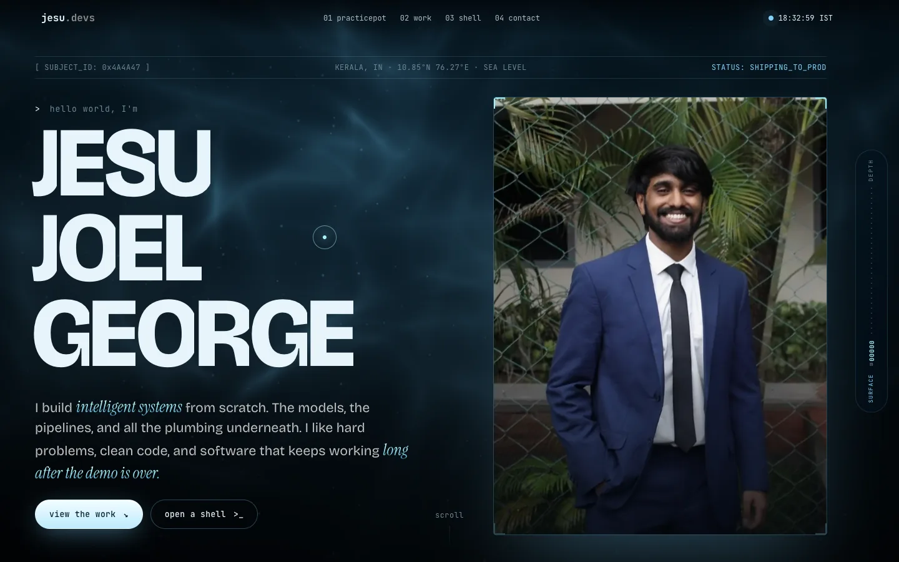
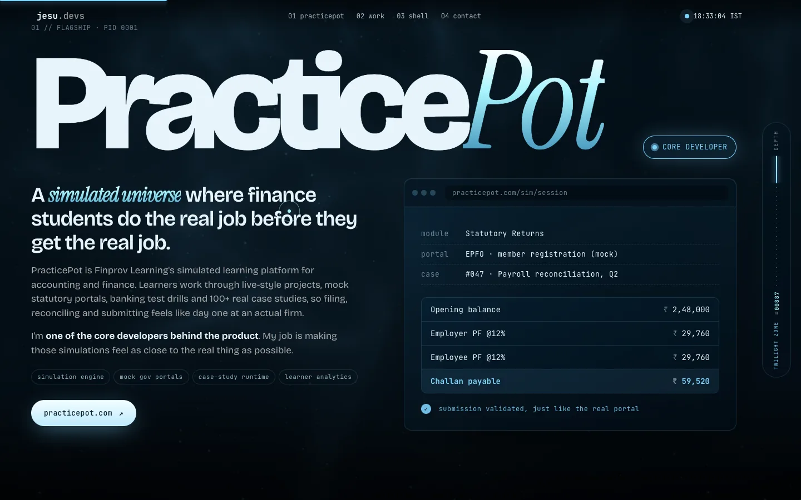
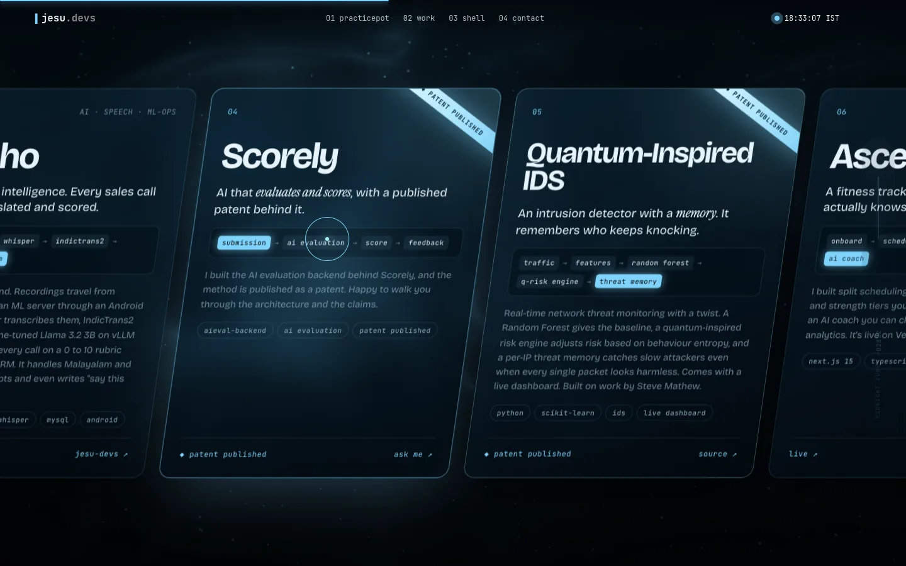
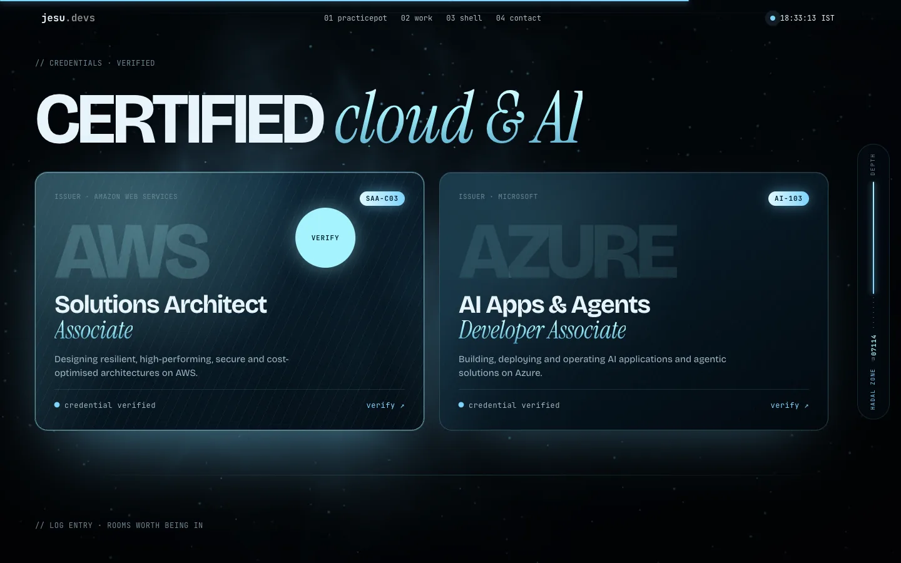
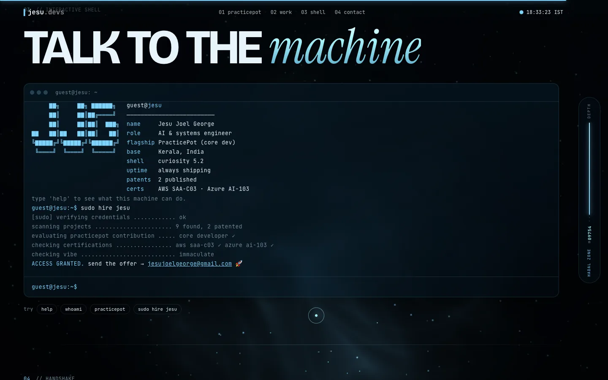
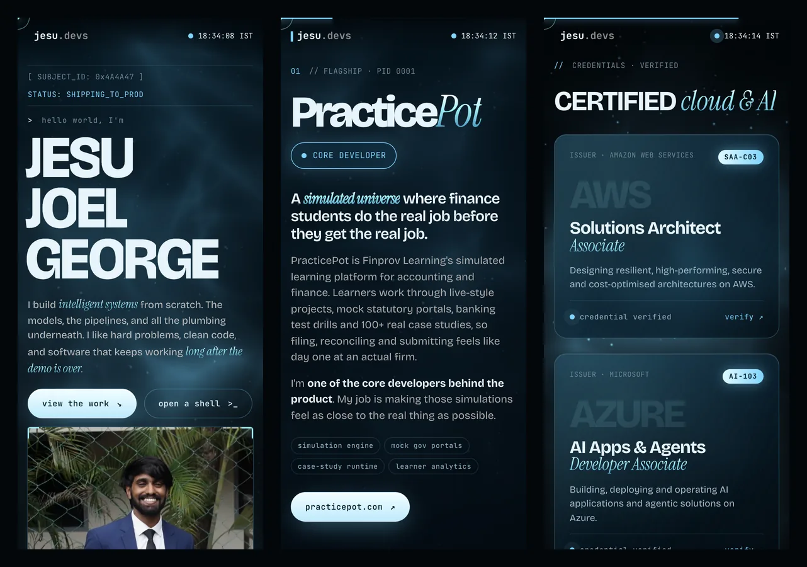

<div align="center">



# jesu.devs

### My portfolio, built like a dive into the deep sea.

Scroll down and you sink. The light fades, the depth gauge counts down to the Challenger Deep,
and somewhere along the way you'll find everything I've built.

<br />


<a href="https://jesu-devs.vercel.app"></a>

<br /><br />

[**Live site**](https://jesu-devs.vercel.app) &nbsp;·&nbsp;
[**LinkedIn**](https://www.linkedin.com/in/jesu-joel-george/) &nbsp;·&nbsp;
[**Email**](mailto:jesujoelgeorge@gmail.com) &nbsp;·&nbsp;
[**PracticePot**](https://practicepot.com/) &nbsp;·&nbsp;
[**More code**](https://github.com/jesu-devs)

</div>

<br />

<div align="center">
  
  <br />
  <sub>A full scroll, from the surface all the way down.</sub>
</div>

<br />

## What's inside

| | |
|---|---|
| **The Deep** | The whole background is a live WebGL shader. Sunlight ripples through the water up top, and it gets darker and quieter the further you scroll. Your cursor works like a diver's torch. |
| **Depth gauge** | A little capsule on the right counts metres as you scroll: surface, twilight zone, midnight zone, abyss, hadal zone, and finally 10,935 m at the Challenger Deep. |
| **PracticePot** | A SaaS simulated learning platform for accounting and finance gets its own section, with a mock browser that types out a live simulation and fills in a ledger. I'm one of the core developers of the product. |
| **Selected systems** | A sideways scrolling rail of project cards, each with an animated pipeline showing how data actually moves through it. Patented work gets a glowing ribbon. |
| **Credentials** | AWS Solutions Architect Associate (SAA-C03) and Azure AI Apps and Agents Developer Associate (AI-103) as real 3D badges built in Three.js: metal rims, clear-coated faces, an engraved back and a ribbon. They float, lean toward your cursor, and you can drag them to spin. Each card links to its official verification page. |
| **A real terminal** | Type `help`, `projects`, `certs`, `patents`, `linkedin` or, if you're hiring, `sudo hire jesu`. |
| **Boot sequence** | The page boots like an old BIOS before it lets you in. Press Enter to skip. |

<br />

<table>
  <tr>
    <td width="50%"></td>
    <td width="50%"></td>
  </tr>
  <tr>
    <td width="50%"></td>
    <td width="50%"></td>
  </tr>
</table>

<div align="center">
  
  <br />
  <sub>Fully responsive. The hero adapts to screen height too, so the buttons are always in view.</sub>
</div>

<br />

## Built to run smoothly anywhere

Fancy effects are only fun if they don't make a cheap laptop cry. So the site checks what it's running on and picks one of four quality levels, then keeps watching the frame rate and steps down if things start to stutter.

| Level | Who gets it | What changes |
|---|---|---|
| **3 Full** | Strong machines in Chrome, Edge or Firefox | Everything on: frosted glass blur, two caustic light layers, film grain, glinting name |
| **2 Balanced** | Safari, 4 core machines, older Intel graphics, phones | Glass becomes solid frosted panels, one light layer, still grain |
| **1 Light** | Weak PCs | Background at 30 fps and lower resolution, native scrolling, no ambient loops |
| **0 Static** | Software rendering or "reduce motion" turned on | The ocean is drawn once and only redrawn as you scroll |

Animations also pause whenever their section is off screen, and the background stops completely when the tab is hidden.

Want to see a specific level? Add `?q=0` to `?q=3` to the URL.

<br />

## Run it locally

No build step and no dependencies. It's just three files.

```bash
git clone https://github.com/jessuiii/Portfolio.git
cd Portfolio
python3 -m http.server 5173
```

Then open [localhost:5173](http://localhost:5173). Or skip all that and see it live at **[jesu-devs.vercel.app](https://jesu-devs.vercel.app)**. Any static host works for deploying it: GitHub Pages, Vercel, Netlify, Cloudflare Pages.

<br />

## How it's put together

```
Portfolio/
├── index.html      every section and all the copy
├── styles.css      design system, layout and the quality levels
├── main.js         boot screen, WebGL ocean, depth gauge, scroll animations, terminal
├── assets/         photos (WebP)
└── docs/           README screenshots
```

- **Vanilla everything.** No React, no bundler, no framework.
- **GSAP and ScrollTrigger** handle the scroll animations and the pinned project rail.
- **Lenis** adds smooth scrolling on machines that can handle it.
- **A hand-written GLSL shader** draws the ocean, the caustics and the drifting marine snow.
- **Fonts:** Bricolage Grotesque, Instrument Serif and JetBrains Mono.

<br />

<div align="center">

**jesu was here**

<sub>Built by vibing with Claude Code.</sub>

</div>
